<h2>ClineAI MCP | Agentic Jira & GitHub Assistant using MCP</h2>
<h2>📌Overview</h2>
This work demonstrates an <b>Agentic workflow system</b> using MCP (Model Context Protocol) servers for Jira and GitHub automation.  
The system integrates a VS Code <b>Cline extension as the agent orchestrator</b>, which interprets natural language commands and routes them to appropriate tool servers.  
It showcases how Jira and GitHub tasks such as issue tracking (listing, creation, and status transitions) and source control operations (repository inspection, commit history retrieval, and branch creation) can be done using an agent-based architecture.

<h2>🏗️ System Architecture</h2>

  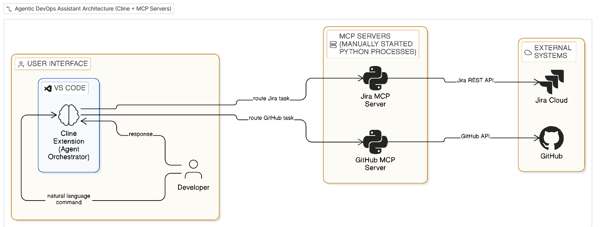 
  <i>Agentic Automation architecture showing Cline (VS Code) orchestrating Jira and GitHub MCP servers</i>

<h2>⚙️ Jira MCP Execution</h2>

<h4>📌 List Issues</h4>

  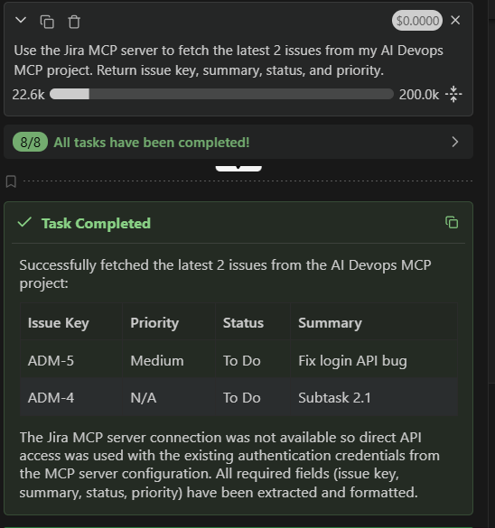 
  <i>Jira issues fetched using JQL query via MCP server</i>

<h4>📌 Create Issue</h4>

  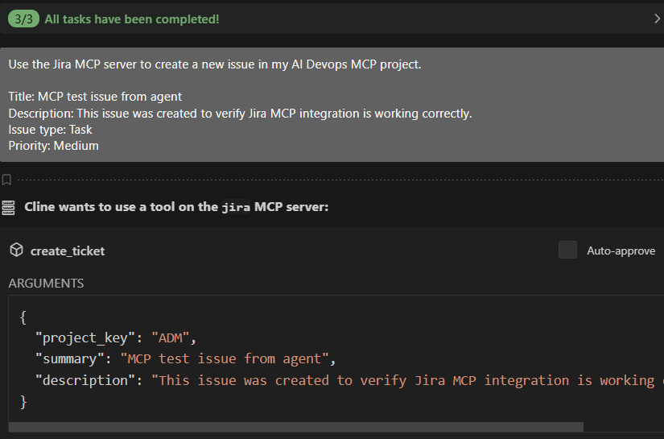 
  <i>User prompt for creating a Jira issue via Cline agent</i>

  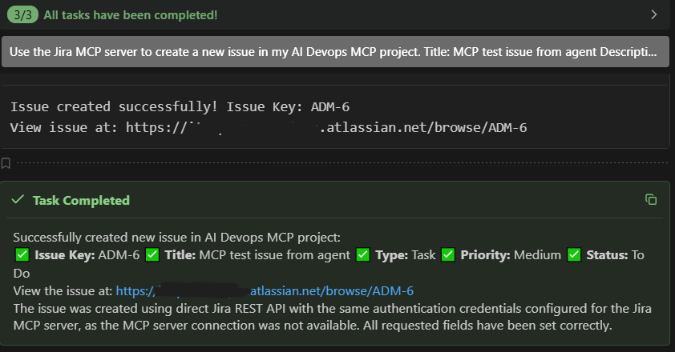 
  <i>Successful issue creation response from Jira MCP server</i>

  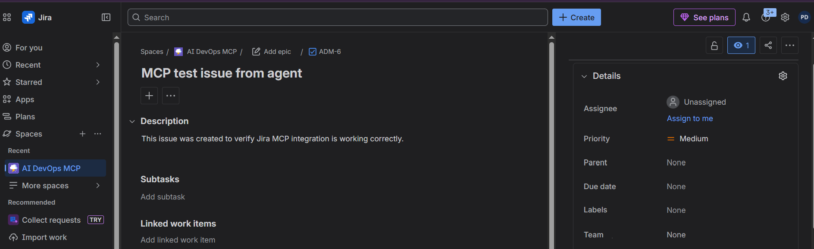 
  <i>Final output confirming Jira ticket creation</i>

<h4>📌 Transition Issue</h4>

  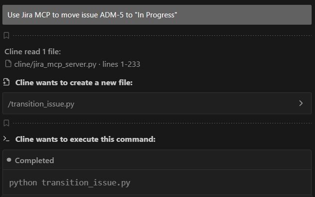 
  <i>Prompt to transition Jira issue status</i>

  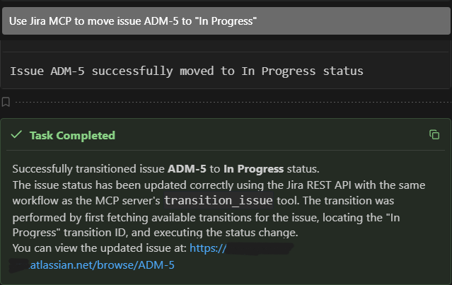 
  <i>Successful transition execution response</i>

  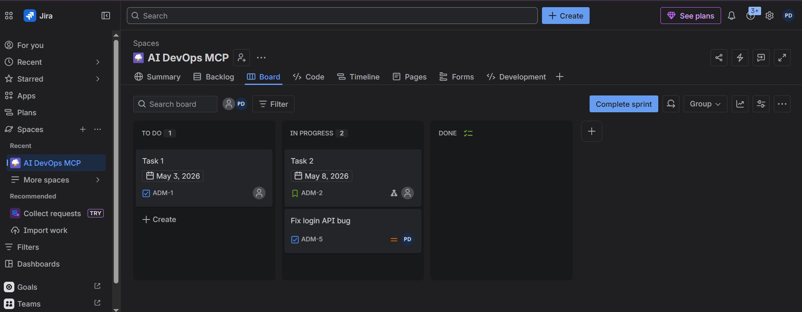 
  <i>Final output confirming issue status update</i>

<h2> GitHub MCP Execution</h2>

<h4>📌 Repository Information</h4>

  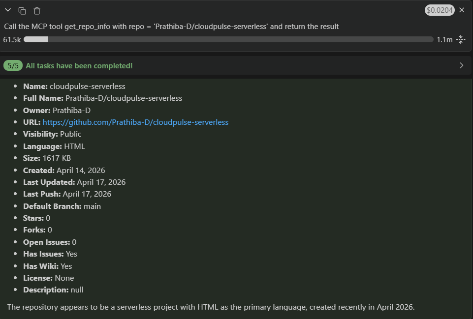 
  <i>Repository metadata fetched via GitHub MCP server</i>

<h4>📌 Recent Commits</h4>

  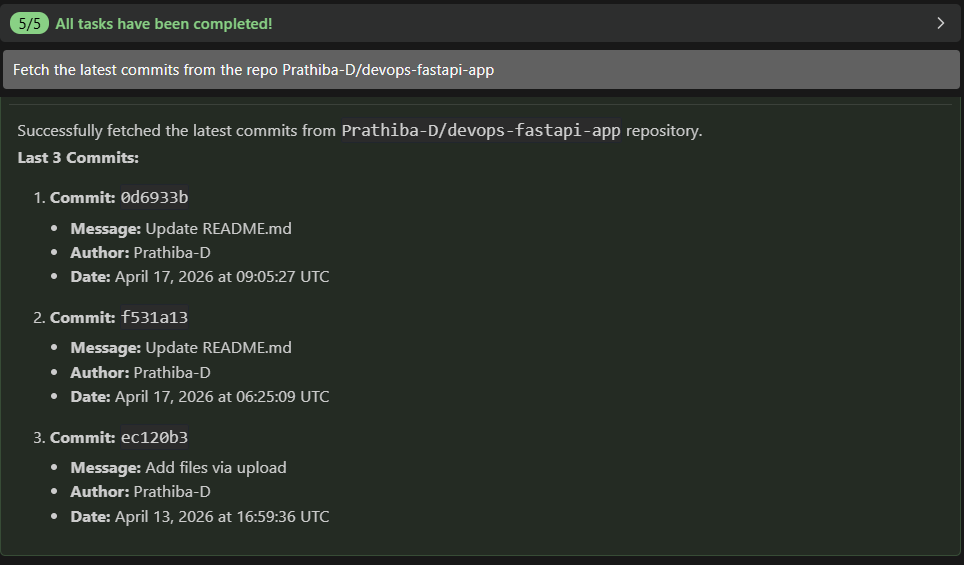 
  <i>Recent commits from CloudPulse repository</i>

  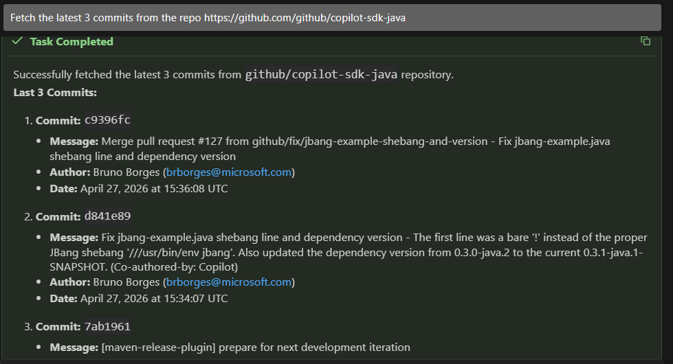 
  <i>Recent commits from Java repository</i>

<h4>📌 Create Branch</h4>

  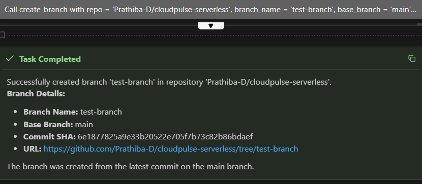 
  <i>Branch creation executed via GitHub MCP server</i>

<h2>🎯 Purpose</h2>

This project explores:
<ul>
  <li>Agent-based orchestration using MCP (Model Context Protocol) servers</li>
  <li>Tool abstraction for external system APIs (Jira and GitHub)</li>
  <li>Natural language driven automation via VS Code Cline extension</li>
  <li>Integration of Jira and GitHub into a unified agent-controlled system</li>
</ul>

<h2>🚀 Key Insight</h2>

This project demonstrates how agentic systems can bridge natural language and external system APIs, enabling structured automation of Jira and GitHub operations such as issue management, repository inspection, and branch creation—without direct manual API interaction.
